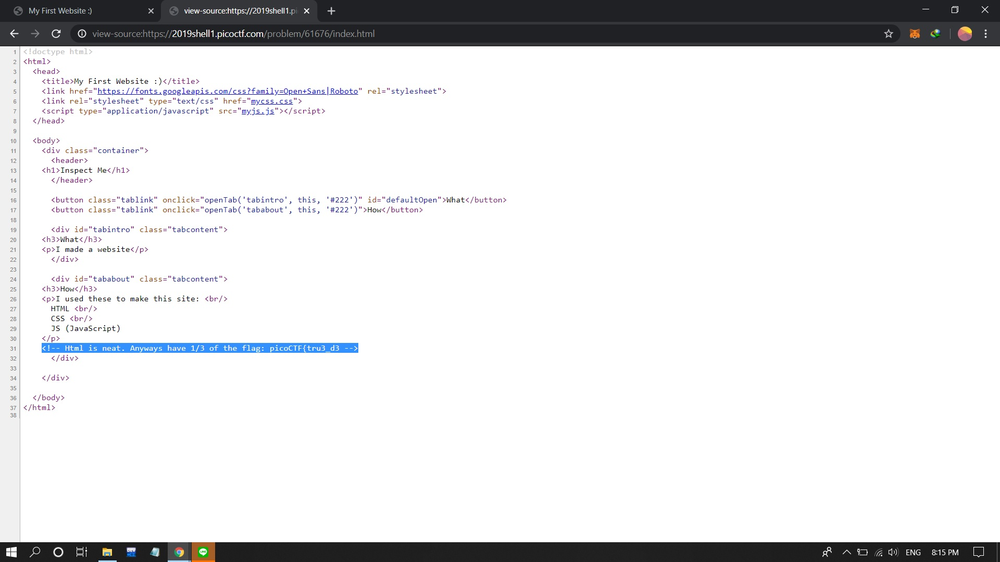

# Insp3ct0r
Poin: 50
## Kategori
Web Exploitation
## Deskripsi
> Kishor Balan tipped us off that the following code may need inspection: `https://2019shell1.picoctf.com/problem/61676/` ([link](https://2019shell1.picoctf.com/problem/61676/)) or http://2019shell1.picoctf.com:61676
## Petunjuk
> How do you inspect web code on a browser?
> There's 3 parts
## Jawaban
Cara menyelesaikannya sangat mudah, bisa dengan membuka source code websitenya dan melihat tag komentar pada website tersebut. di website tersebut terdapat 3 files yaitu index.html,mycss.css, dan myjs.js

## Flag
`picoCTF{tru3_d3t3ct1ve_0r_ju5t_lucky?1638dbe7}`