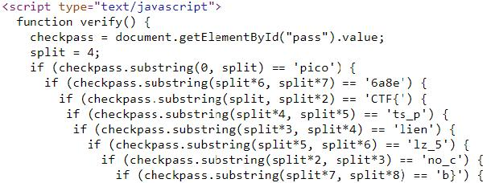

# dont-use-client-side
Poin: 100
## Kategori
Web Exploitation
## Deskripsi
> Can you break into this super secure portal? `https://2019shell1.picoctf.com/problem/21888/` ([link](https://2019shell1.picoctf.com/problem/21888/)) or http://2019shell1.picoctf.com:21888
## Petunjuk
> Never trust the client
## Jawaban
Cara menyelesaikannya bisa dengan membuka source code websitenya dan melihat terdapat skript flag menjadi substring. Ketika mencocokkan substring dengan indeks yang diberikan, kita akan mendapatkan flag.

## Flag
`picoCTF{no_clients_plz_56a8eb}`