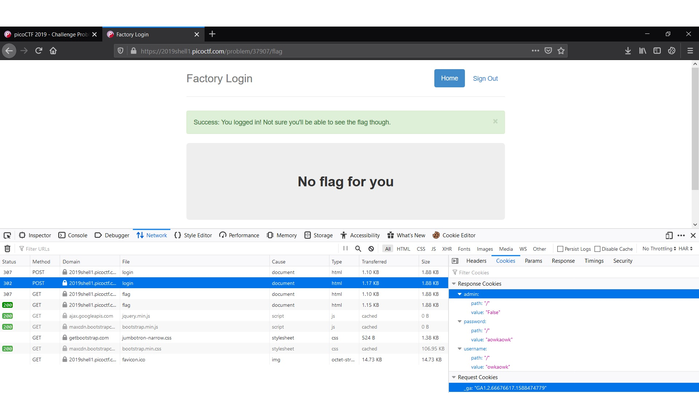

# logon
Poin: 100
## Kategori
Web Exploitation
## Deskripsi
> The factory is hiding things from all of its users. Can you login as logon and find what they've been looking at? `https://2019shell1.picoctf.com/problem/37907/` ([link](https://2019shell1.picoctf.com/problem/37907/)) or http://2019shell1.picoctf.com:37907
## Petunjuk
> Hmm it doesn't seem to check anyone's password, except for {{name}}'s?
## Jawaban
Cara menyelesaikannya dengan mengubah value dari cookies website tersebut. Jika kita membuka inspect element dan login, website akan menyimpan tiga cookie saat login yaitu admin, password, dan username. Fokus pada cookie admin berupa tipe data boolean. dengan mengganti cookie admin yang awalnya 'False' menjadi 'True'. maka kita akan masuk ke dashboard menjadi admin dan mendapatkan flag

## Flag
`picoCTF{th3_c0nsp1r4cy_l1v3s_2e19dad3}`